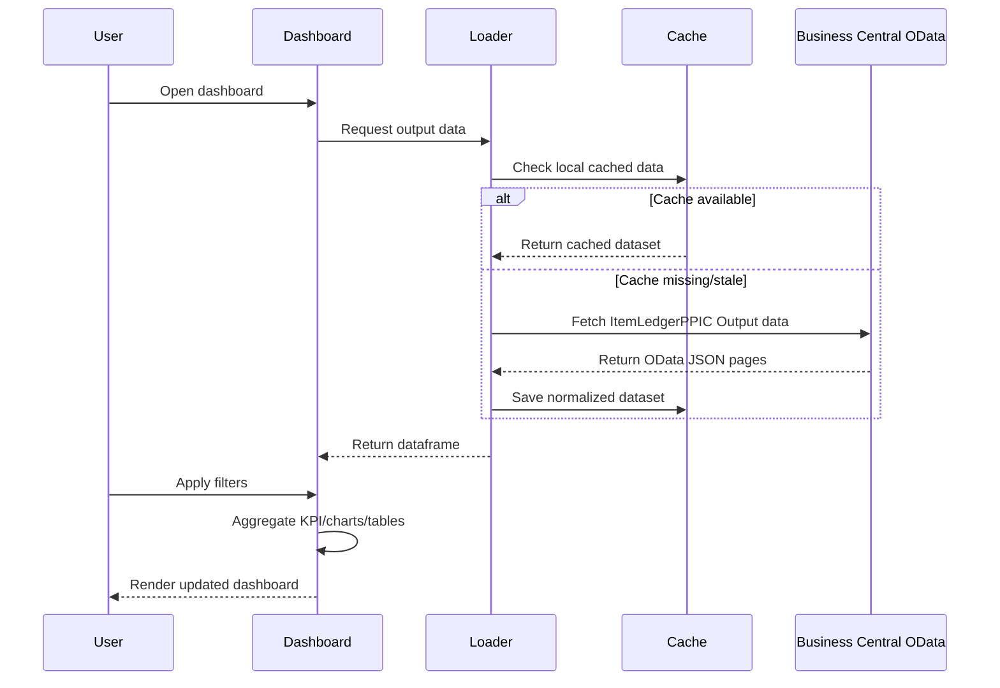

# PRD — PPIC Output Dashboard

## 1. Overview

PPIC Output Dashboard adalah dashboard internal untuk memonitor output produksi berdasarkan data Business Central OData V4 service `ItemLedgerPPIC`.

Tahap awal menggunakan data `Entry_Type = Output` untuk 3 bulan terakhir. Dashboard ditujukan untuk membantu PPIC dan operasional melihat performa output harian, mesin, item, kategori, dan SPK secara cepat tanpa harus membuka data mentah Business Central/Excel.

### Initial data profile

- Service: `ItemLedgerPPIC`
- Current extracted period: 2026-02-13 s/d 2026-05-12
- Rows: 5,804
- Total quantity: ±227.69 juta pcs
- Unique machine/entity: 37
- Unique item: 207
- Unique document/SPK: 390
- Unique category: 9

## 2. Requirements

### Functional requirements

1. Dashboard dapat membaca data output produksi dari CSV awal dan nantinya dari OData V4.
2. User dapat memfilter data berdasarkan:
   - Posting date range
   - Machine center
   - Production/rotation line
   - Item category
   - Item number / item description
   - Document/SPK number
3. Dashboard menampilkan KPI utama:
   - Total output quantity
   - Jumlah SPK/dokumen
   - Jumlah item unik
   - Jumlah mesin aktif
   - Rata-rata output per active day
4. Dashboard menampilkan visualisasi:
   - Output harian
   - Output per mesin
   - Output per production line
   - Output per item category
   - Top item by quantity
   - Output per SPK/document
5. Dashboard menyediakan tabel detail yang bisa difilter dan diexport.
6. Dashboard menyimpan metadata entity mesin sebagai dasar master data awal.
7. Dashboard dapat dikembangkan untuk refresh langsung dari OData V4 dengan credential aman.
8. Dashboard mendukung import backfill downtime dari CSV/XLSX export (termasuk file yang diekspor dari Excel) untuk mengisi histori event lama secara idempotent.
9. Template backfill downtime hanya meminta field yang perlu diisi user, menandai field wajib vs opsional, dan menyediakan contoh isian.

### Non-functional requirements

1. Cepat untuk data skala puluhan ribu sampai ratusan ribu baris.
2. Mudah dijalankan lokal/server internal.
3. Tidak menyimpan credential mentah di source code atau dokumentasi publik.
4. Struktur code mudah dikembangkan ke modul reject, downtime, atau planning.
5. Format angka dan tanggal mudah dibaca user operasional.

## 3. Core Features

### MVP

1. **Executive Summary**
   - Total quantity
   - Active days
   - Active machines
   - Unique items
   - Unique SPK

2. **Output Trend**
   - Grafik output harian
   - Optional aggregation: daily/weekly/monthly

3. **Machine Performance**
   - Ranking mesin by output
   - Detail output mesin per tanggal
   - Entity machine list dari `Machine_Center_No`

4. **Item & Category Analysis**
   - Top item by quantity
   - Output by item category
   - Search item number/description

5. **SPK / Document Monitoring**
   - Output by `Document_No` / `Order_No`
   - Drill-down transaksi per dokumen

6. **Detail Table & Export**
   - Tabel transaksi filtered
   - Download CSV/Excel hasil filter

### Next phase

1. Direct OData refresh.
2. Scheduled data refresh.
3. Data quality alerts.
4. Output vs reject analysis jika reject dataset tersedia.
5. Output vs plan/capacity jika data planning tersedia.
6. Downtime backfill import + dedupe/upsert untuk histori event lama.
7. Hardening Copas WA parser + normalizer untuk downtime import, termasuk schema freeze, alias registry eksplisit, preview diff + `match_code` / `warning_code` yang lebih jelas, dan fixture regression.

## 4. User Flow

1. User membuka dashboard.
2. Dashboard load data terbaru dari local cache/CSV.
3. User memilih periode tanggal.
4. User memilih filter mesin/category/item bila perlu.
5. Dashboard memperbarui KPI, chart, dan tabel detail.
6. User drill-down ke mesin/item/SPK tertentu.
7. User export data hasil filter untuk analisa lanjutan.

## 5. Architecture

### MVP architecture

```text
CSV Extract / Local Cache
        |
        v
Data Loader + Cleaning Layer
        |
        v
Aggregation Layer
        |
        v
Streamlit Dashboard UI
        |
        +--> Charts
        +--> Detail Tables
        +--> Export CSV/Excel
```

### Future architecture with OData

```text
Business Central OData V4: ItemLedgerPPIC
        |
        | Basic Auth / secure env secrets
        v
OData Fetcher
        |
        v
Local Cache: CSV/Parquet/SQLite
        |
        v
Data Cleaning + Entity Mapping
        |
        v
Dashboard API / Streamlit App
```

## 6. Sequence Diagram



## 7. Database Schema

### Fact table: `fact_item_ledger_output`

| Field | Source | Notes |
|---|---|---|
| posting_date | Posting_Date | Date filter utama |
| document_date | Document_Date | Date dokumen |
| entry_type | Entry_Type | MVP only `Output` |
| document_no | Document_No | SPK/dokumen |
| order_no | Order_No | Production order |
| entry_no | Entry_No | Unique BC entry reference |
| item_no | Item_No | Item code |
| item_description | Description / gItem_Description | Nama item |
| item_category_code | Item_Category_Code | Category grouping |
| machine_center_no | Machine_Center_No | Entity mesin |
| prod_line_no | gProdOrRotLine_No | Production/rotation line |
| prod_line_description | gProdOrRotLine_Description | Deskripsi line |
| location_code | Location_Code | Lokasi |
| quantity | Quantity | Output qty |
| unit_of_measure_code | Unit_of_Measure_Code | UOM |
| lot_no | Lot_No | Lot produksi |
| source_no | Source_No | Source item/customer per BC |
| source_desc | gSrcDesc | Source description |
| bahan_type | Bahan_Type | Material type |
| color | Color | Color attribute |
| gramasi | Gramasi | Weight/grammage attribute |
| gross_weight | Gross_Weight | Gross weight |
| divcode | divcode | Division code |
| divname | divname | Division name |

### Dimension table: `dim_machine`

| Field | Notes |
|---|---|
| machine_center_no | Primary machine entity |
| top_prod_line_no | Dominant production line from historical output |
| top_prod_line_description | Dominant line description |
| top_item_category | Dominant output category |
| first_posting_date | First date seen in dataset |
| last_posting_date | Last date seen in dataset |
| unique_item_count | Count of item variants produced |
| unique_document_count | Count of SPK/documents |
| total_quantity | Historical output qty in loaded period |

Initial machine entity file already created: `/root/.openclaw/workspace/entity_machines_itemledgerppic.csv`.

### Downtime import key

Backfill downtime memakai natural key: `event_date + shift_code + area + machine + line + category + start_time + end_time` supaya CSV/XLSX bisa di-run ulang tanpa menggandakan data.

Template input disederhanakan ke: `event_date, shift_code, area, machine, line, category, start_time, end_time, status, pic, root_cause, action_taken`.

## 8. Tech Stack

### Recommended MVP

- Python
- Pandas / Polars for data processing
- Streamlit for dashboard UI
- Plotly for interactive charts
- CSV/Parquet for local cache
- Optional SQLite if data grows or needs incremental refresh

### Deployment target

- Internal local/server deployment first.
- Run with `streamlit run app.py`.
- Later can be wrapped with systemd/Docker if needed.

## 9. AI Integration

### UI/UX assistance

AI can help generate chart explanations, anomaly notes, and natural-language summaries from the filtered dashboard state.

Example summaries:
- "Output minggu ini turun dibanding minggu lalu terutama dari mesin X dan Y."
- "Top contributor periode ini adalah category JADI-PRINTING dengan kontribusi sekian persen."

### Main AI capabilities

1. Explain trend changes.
2. Detect anomalies such as zero-output days, sudden drops, duplicate/odd transactions, or unusual machine-item combinations.
3. Generate PPIC daily/weekly summaries.
4. Suggest follow-up questions for planning analysis.

### Technical implementation & security

1. AI layer must not receive raw credentials.
2. AI summaries should work from aggregated/filtered data, not full sensitive raw data unless explicitly needed.
3. Keep manual review before sending summaries outside dashboard.
4. Never expose Business Central password in logs, UI, repo, or memory.

## 10. Open Questions / Assumptions

### Current assumptions

1. MVP starts from CSV extract already pulled from OData.
2. Main dashboard metric is `Quantity` in base/display unit from Business Central.
3. `Machine_Center_No` is the primary machine entity.
4. `gProdOrRotLine_No` is treated as production/rotation line grouping.
5. Output period defaults to last 3 months.

### Questions to validate later

1. Should quantity be shown only in PCS, or mixed UOM must be normalized?
2. Should AV/reject-like categories be included in output dashboard or separated?
3. Which users will use it: PPIC only, production, management, or all?
4. Do we need login/access control for dashboard?
5. Preferred deployment location: this OpenClaw host, Windows server, or another internal machine?
